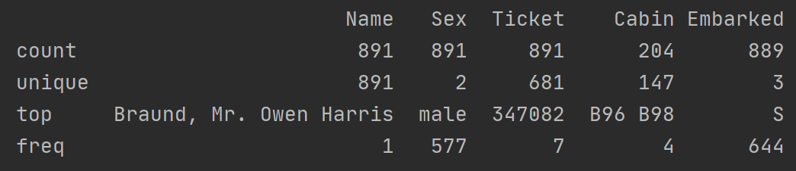
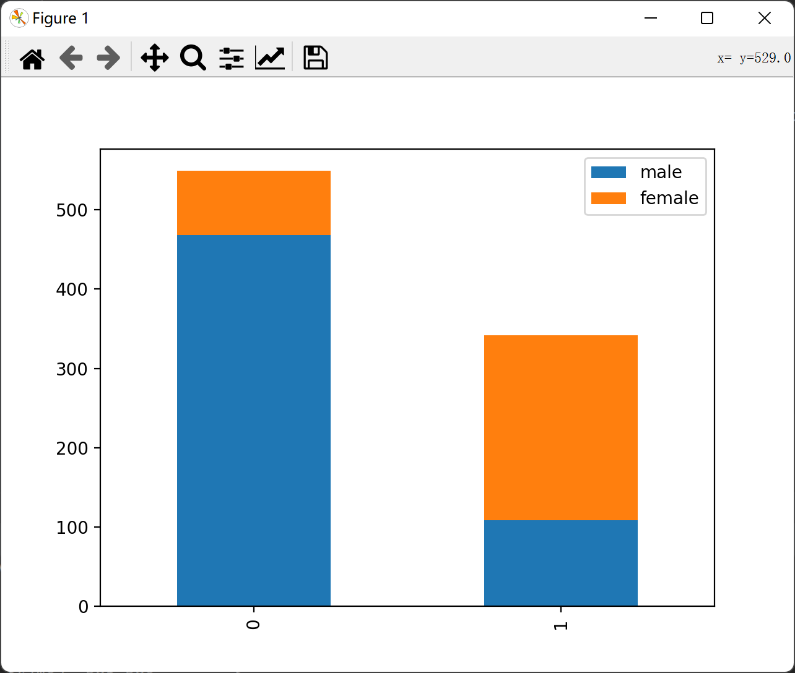
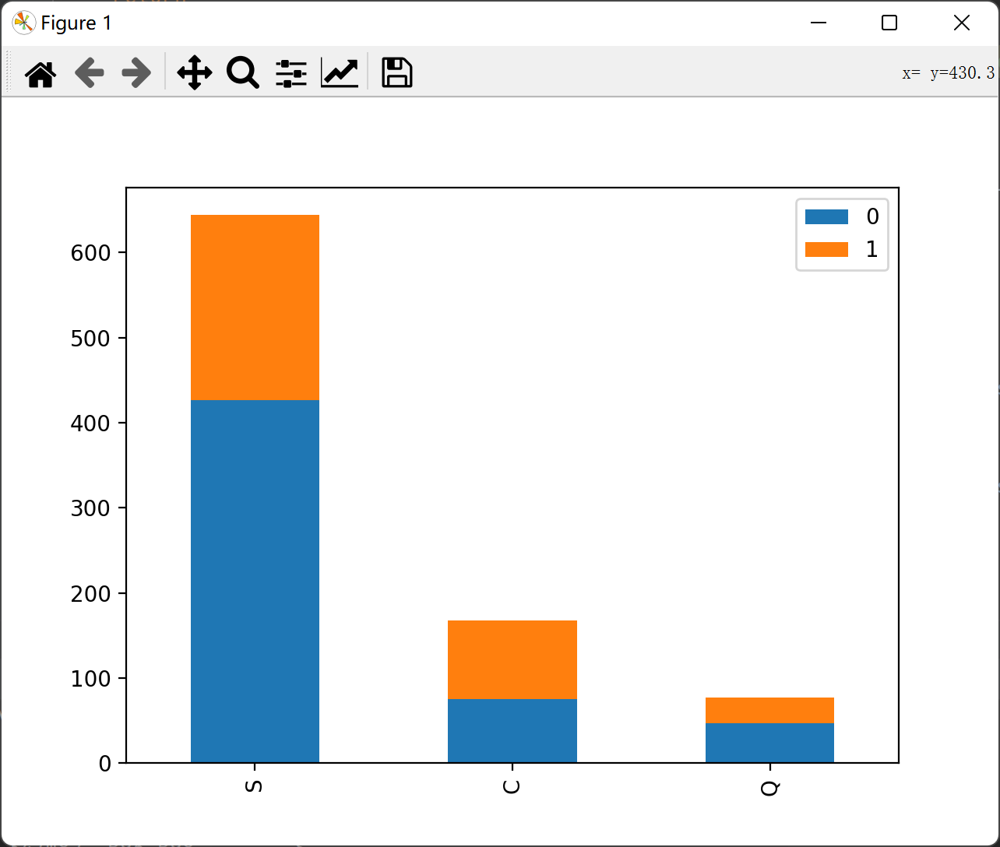
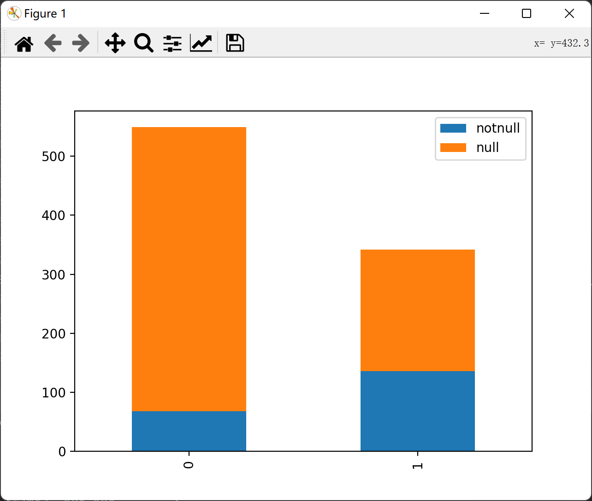
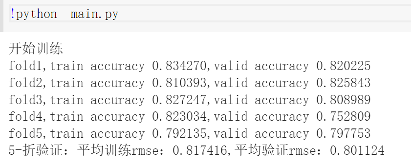

### Titanic - Machine Learning from Disaster

#### 数据分析

对于数字类型的数据，由于数据量不大，进行归一化后均值填充即可

对于object类型的数据，统计结果如下：



查看各个离散数据对于结果的影响

- sex：[male,female]

	

	可以看出在在获救人中，女性的数量更多

- Embarked: [S,Q,C]

	

	看起来上船位置对结果没有什么影响

对于Ticket和Cabin这两个数据

- 对于Ticket数据，船票的数据太多太杂了，暂且不分析

- 对于Cabin数据，有部分乘客有，有部分没有。将是否有这个cabin属性作为特征，可能有些人遇难后船票丢失就无法统计了

  

  可以看出来有幸存的对象中，有cabin这个属性的百分比多一些

#### 数据处理

经过分析，保留以下数据：

```python
            Pclass          Age        SibSp        Parch         Fare
count  1309.000000  1046.000000  1309.000000  1309.000000  1308.000000
mean      2.294882    29.881138     0.498854     0.385027    33.295479
std       0.837836    14.413493     1.041658     0.865560    51.758668
min       1.000000     0.170000     0.000000     0.000000     0.000000
25%       2.000000    21.000000     0.000000     0.000000     7.895800
50%       3.000000    28.000000     0.000000     0.000000    14.454200
75%       3.000000    39.000000     1.000000     0.000000    31.275000
max       3.000000    80.000000     8.000000     9.000000   512.329200

                           Name   Sex  Ticket    Cabin Embarked
count                       891   891     891      204      889
unique                      891     2     681      147        3
top     Braund, Mr. Owen Harris  male  347082  B96 B98        S
freq                          1   577       7        4      644
```

其中Age，Cabin，Fare和Embarked存在数据缺失，对不同缺失数据进行不同的处理

- Age：使用随机森林的方法去预测年龄，因为年龄和消费水准、家庭关系等可能有关系

  ```python
  def set_missing_age(df):
      age_df = df[['Age', 'Fare', 'Parch', 'SibSp', 'Pclass']]
      # age非空的的词条
      known_age = age_df[age_df['Age'].notnull()].values
      unknown_age = age_df[age_df['Age'].isnull()].values
  
      y = known_age[:, 0]
      x = known_age[:, 1:]
  
      # n_estimators集成随机树的个数，n_job并行度
      rfr = RandomForestRegressor(random_state=0, n_estimators=2000, n_jobs=-1)
      rfr.fit(x, y)
  
      predictedAges = rfr.predict(unknown_age[:, 1:])
      df.loc[df['Age'].isnull(), 'Age'] = predictedAges
  ```

- Cabin：将Cabin分为null和not null两种

- Fare：进行均值补充

- Embarked：在one_hot编码时会有nan一栏，就分为{S，C，O，nan}四种

#### 训练

该问题是一个二分类问题，预测类别为0/1

模型如下

```python
class my_model(nn.Module):
    def __init__(self, in_features):
        super().__init__()
        self.layer1 = nn.Linear(in_features, in_features)
        self.sigmoid1 = nn.Sigmoid()

    def forward(self, x):
        x = self.layer1(x)
        x = self.sigmoid1(x)
        return x
```

训练超参数为：

```python
k, num_epochs, lr, weight_decay, batch_size = 5, 1000, 1, 0, 4
```

训练结果为：

- 单层MLP：

- 双层MLP：

  

正确率大约在70%左右，采用K=5的K折交叉验证的方法，学习为主，不再进行调参了

双层MLP的训练过程如下，单层MLP的训练和验证误差都在77%左右，双层网络的训练和验证误差更好，但是泛化性能有所下降，有两种可能：

1. 超参数选择不同，进行合理调参可能会有不同结果
2. 双层MLP模型复杂度较高，造成了过拟合现象



#### 二分类问题的损失函数

titanic问题是一个二分类问题，要根据给出的属性，预测最后的Survived熟悉为0/1。二分类问题有以下的损失函数

1. nn.BCELoss()

   BECLoss的全称是（Binary CrossEntropy）
   $$
   l_n=−w_n[y_i*logp_i+(1−y_i)⋅log(1−p_i)]
   $$
   其中，$y_i$是第i个样本的标签，$p_i$是第i个样本的预测值(是一个概率)。我们将最后的结果用sigmoid压缩到[0,1]区间内，然后利用二分类交叉熵损失进行训练

   ```python
   loss_fn = nn.BCELoss()
   
   class MLP(nn.Module):
       '''自己定义网络的层,要继承nn.Module'''
       def __init__(self):
           super().__init__()
           self.Lin = nn.Linear(in_features=2, out_features=1)
           self.Sig = nn.Sigmoid()
           
       def forward(self, x):
           '''定义前向过程,输出shape为(batch,)'''
           logit = self.Lin(x)
           y_pred = self.Sig(logit)
           return y_pred 
       
   loss_fn = nn.BCELoss()
   
   X = torch.FloatTensor(np.array([[1,2],[3,4],[5,6]]))
   y = torch.FloatTensor(np.array([[0],[1],[0]])) #shape=(batch,1)，并且是float32
   model = MLP()
   y_pred = model(X)
   loss = loss_fn(y_pred,y) #
   ```

2. nn.BCEWithLogitsLoss()

   相比于BCELoss，该损失无需再计算前先使用sigmoid压缩输出，损失函数中自带sigmoid

   ```python
   loss_fn = nn.BCEWithLogitsLoss()
   class MLP(nn.Module):
       '''自己定义网络的层,要继承nn.Module'''
       def __init__(self):
           super().__init__()
           self.Lin = nn.Linear(in_features=2, out_features=1)
           self.Sig = nn.Sigmoid()
           
       def forward(self, x):
           '''定义前向过程,输出shape为(batch,)'''
           logit = self.Lin(x)
           return logit #区别就在这里啦'''
   
   X = torch.FloatTensor(np.array([[1,2],[3,4],[5,6]]))
   y = torch.FloatTensor(np.array([[0],[1],[0]])) #shape=(batch,1)，并且是float32
   model = MLP()
   y_pred = model(X)
   loss = loss_fn(y_pred,y) #
   ```

3. nn.NLLLoss()

   负对数似然损失
   $$
   H(p,q)=-\sum_xp(x)log(q(x))
   $$
   其中p和q都是大小为C(分类类别)的tensor，p是标签，对应类别为1，q代表预测的输出结果

   ```python
   C = 4 
   loss_fn = nn.NLLLoss()
   class MLP(nn.Module):
       '''自己定义网络的层,要继承nn.Module'''
       '''这里out设定为类别数'''
       def __init__(self):
           super().__init__()
           self.Lin = nn.Linear(in_features=2, out_features=C)
           
       def forward(self, x):
           '''定义前向过程,输出shape为(batch,C)'''
           logit = self.Lin(x)
           return logit.log_softmax(-1)
   
   X = torch.FloatTensor(np.array([[1,2],[3,4],[5,6]]))
   y = torch.LongTensor(np.array([0,2,3])) #shape=(batch)，并且是long
   model = MLP()
   y_pred = model(X)
   loss = loss_fn(y_pred,y) #
   ```

4. nn.CrossEntropyLoss()

   相比于BLLLoss，crossEntropy直接输入一个长为C的tensor，crossEntropy损失会自动将其归一化(log_softmax)，具体来说crossEntropy=softmax+log+NLLLoss

   ```python
   loss_fn = nn.CrossEntropyLoss()
   class MLP(nn.Module):
       '''自己定义网络的层,要继承nn.Module'''
       '''这里out设定为类别数'''
       def __init__(self):
           super().__init__()
           self.Lin = nn.Linear(in_features=2, out_features=C)
           
       def forward(self, x):
           '''定义前向过程,输出shape为(batch,C)'''
           logit = self.Lin(x)
           return logit
   
   X = torch.FloatTensor(np.array([[1,2],[3,4],[5,6]]))
   y = torch.LongTensor(np.array([0,2,3])) #shape=(batch)，并且是long
   model = MLP()
   y_pred = model(X)
   loss = loss_fn(y_pred,y) #
   ```
